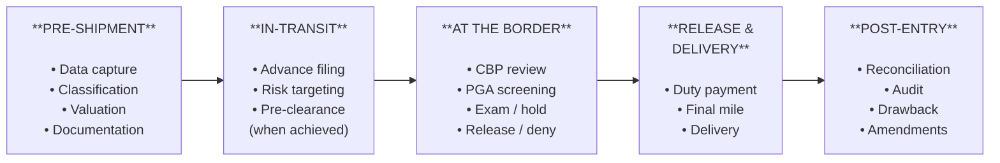

# Global Customs Clearance: How Clearance Works Today

> **FedEx Global Clearance Knowledge Base**
> Last Updated: January 2026

---

## Executive Summary

This document provides a detailed, operational-level description of how customs clearance actually works today — from pre-shipment through post-entry — and identifies where the process breaks. Understanding today's process in its full complexity is essential context for envisioning how it must change. Every inefficiency, handoff, and failure point documented here represents an opportunity for transformation.

---

## 1. End-to-End Clearance Process Flow

### The Clearance Lifecycle

Customs clearance is not a single event — it is a multi-stage process that begins before goods leave the origin country and can extend months after goods are delivered. The stages are:

---

## 2. Stage 1: Pre-Shipment

### Data Capture

The quality of clearance begins — and often ends — with the data captured before goods ship. Required data elements include:

**Commercial Data:**
- Detailed product description (what is it, what is it made of, what is its function)
- Value (transaction value, including any assists, royalties, or buying commissions)
- Quantity and unit of measure
- Country of origin (where the product was manufactured, not where it was shipped from)
- Country of export (where the shipment originates)
- Manufacturer/supplier name and address
- Buyer/importer name and address
- Currency and Incoterms (DDP, DDU, FOB, CIF, etc.)

**Regulatory Data:**
- HTSUS classification (10-digit tariff code)
- Applicable tariff program indicators (Section 301, 232, IEEPA, AD/CVD)
- FTA preference claims and supporting certificates of origin
- PGA-specific data (FDA product codes, EPA TSCA certifications, CPSC compliance data)
- UFLPA compliance documentation (for goods with potential Xinjiang exposure)
- Export control classification (for dual-use goods)
- Denied party screening results

**Logistics Data:**
- Transport mode and carrier
- Port of entry / gateway
- Estimated arrival date and time
- Piece count and weight (gross and net)
- Container or tracking numbers

### Where Pre-Shipment Breaks

**Problem: Data not available at origin.** For many shipments — particularly e-commerce — the shipper does not have HTSUS codes, does not know the exact duty treatment, and provides only a minimal product description. The data gap must be filled by the carrier or broker, often under severe time pressure.

**Problem: Classification happens too late.** Classification should happen before goods ship, but it often happens after goods are already in transit or at the border. Late classification means late filing, which eliminates pre-clearance opportunities.

**Problem: Documentation is fragmented.** Commercial invoices, packing lists, certificates of origin, and PGA certificates are created in different systems, by different parties, often in different formats. Assembling a complete documentation package requires manual coordination.

---

## 3. Stage 2: In-Transit — Advance Filing and Pre-Clearance

### Advance Electronic Data Submission

Express carriers are required to submit advance electronic data to destination customs authorities before goods arrive:

**US (CBP):**
- **Air Cargo Advance Screening (ACAS):** Minimum data set (shipper, consignee, description, origin, destination, piece count, weight) must be submitted before aircraft departure.
- **Entry filing:** Formal entries can be filed up to 5 days before arrival for pre-clearance.
- **ACE electronic filing:** All entry data is submitted through the Automated Commercial Environment.

**EU (ICS2):**
- **Entry Summary Declaration (ENS):** Must be submitted before goods depart for the EU (air cargo: before loading; express: before arrival).
- **ICS2 data elements:** Shipper and consignee details, goods description, HS code (6-digit minimum), value, weight, transport details.
- **Pre-arrival risk assessment:** EU customs uses ICS2 data to perform risk analysis before goods arrive.

**UK:**
- **Safety and security declarations** required before goods arrive in the UK.
- Filing through the Customs Declaration Service (CDS).

### Pre-Clearance: The Goal

Pre-clearance means that all customs processing — entry filing, risk assessment, PGA screening, and release decision — is completed **before** goods physically arrive at the destination. When pre-clearance is achieved:

- Goods are released immediately upon arrival.
- No warehouse dwell time.
- Transit time commitments are maintained.
- The shipper and consumer experience is seamless.

**Current pre-clearance rates vary significantly:**
- For well-documented, routine commercial shipments with complete data: pre-clearance rates can exceed **70-80%** in favorable trade lanes.
- For e-commerce parcels with minimal data: pre-clearance rates are significantly lower, often **30-50%** or less.
- Overall industry average for express shipments: estimated **50-70%**, varying widely by trade lane, product category, and carrier.

### Where In-Transit Processing Breaks

**Problem: Incomplete data prevents advance filing.** If shipper data is incomplete (no HTSUS code, vague description, missing origin), the entry cannot be filed until the data is corrected — which may not happen until goods arrive and are physically inspected.

**Problem: Timing constraints.** Express operations move on tight schedules. Goods may arrive at the gateway within hours of being picked up. This leaves minimal time for advance filing and pre-clearance processing, especially when data correction is needed.

**Problem: System latency.** Even when entries are filed in advance, customs processing systems may not return a release decision before goods arrive. ACE processing times can vary, and PGA reviews often have their own timelines.

---

## 4. Entry Types

### US Entry Types

**Formal Entry (Entry Type 01):**
- Required for goods valued at **$2,500 or more** (and now for all goods, regardless of value, following de minimis suspension).
- Full customs data required: 10-digit HTSUS, value, origin, importer of record, bond information.
- Duties assessed and must be paid (or bonded) before release.
- Subject to liquidation, audit, and potential penalty action.
- The standard entry type for commercial imports.

**Informal Entry (Entry Type 11):**
- For goods valued under $2,500 (where formal entry is not required and de minimis does not apply).
- Simplified data requirements.
- Duty payment at time of entry.
- Limited post-entry audit exposure.

**Section 321 / De Minimis (Entry Type 86) — NOW SUSPENDED:**
- Previously used for goods valued at $800 or less.
- Minimal data requirements (shipper, consignee, description, value).
- No duties or taxes assessed.
- **Entry Type 86** was introduced in 2019 as a hybrid: allowed Section 321 duty-free treatment while providing CBP with additional data for security and enforcement targeting. It required 6-digit HS code, country of origin, and FTZ/foreign trade zone information.
- **As of August 29, 2025:** Section 321 is suspended for all countries. Entry Type 86 is effectively deprecated. All shipments require formal entry (Type 01) or informal entry (Type 11) as applicable.

**Temporary Importation under Bond (TIB) — Entry Type 06:**
- For goods imported temporarily (exhibitions, repairs, testing) that will be re-exported.
- Duty deferred, secured by bond.
- Strict timeline for re-export (usually 1 year, extendable).

**Foreign Trade Zone (FTZ) — Entry Type 06/26:**
- Goods admitted to FTZ for storage, manipulation, or manufacturing.
- Duties deferred until goods enter US commerce (or eliminated if goods are re-exported).

**Warehouse Entry — Entry Type 21:**
- Goods placed in a bonded warehouse.
- Duties deferred until withdrawal for consumption.
- Maximum 5-year storage period.

---

## 5. Stage 3: At the Border — CBP Review and Decision

### The CBP Processing Pipeline

When an entry is filed in ACE, it proceeds through a multi-stage processing pipeline:

**Step 1: Automated Selectivity**
- ACE's targeting system evaluates the entry against thousands of risk rules and algorithms.
- Factors considered: importer history, country of origin, product category, value anomalies, carrier risk profile, specific enforcement campaigns (UFLPA, fentanyl, IPR), and intelligence-driven targeting.
- Outcome: **Release** (no further action) or **Hold/Exam** (further review required).

**Step 2: Admissibility Review**
- For entries not immediately released, CBP import specialists review the entry for admissibility.
- Checks include: classification accuracy, value reasonableness, applicable tariff programs, trade remedy orders (AD/CVD), prohibited/restricted goods, and PGA requirements.
- This step may be performed by CBP officers at the port of entry or by Centers of Excellence and Expertise (CEEs) specializing in specific industries.

**Step 3: PGA Screening**
- ACE routes entry data to applicable Partner Government Agencies based on product classification and other indicators.
- Each PGA performs its own review:
  - **FDA:** Reviews food, drugs, medical devices, cosmetics, biologics, tobacco, and radiation-emitting products. May require prior notice (food), registration (drugs/devices), or import alerts.
  - **USDA/APHIS:** Reviews plant and animal products for pest and disease risk. May require phytosanitary or veterinary certificates.
  - **EPA:** Reviews chemicals (TSCA), vehicles (emissions), and pesticides (FIFRA).
  - **CPSC:** Reviews consumer products for safety compliance. RAM pilot program for e-commerce targeting.
  - **FCC:** Reviews electronic devices for equipment authorization.
  - **TTB:** Reviews alcohol and tobacco products for permits and labeling.
  - **Fish & Wildlife:** Reviews wildlife and wildlife products for CITES and Lacey Act compliance.
- PGA review timelines are **independent** of CBP processing. A shipment may be released by CBP but held by a PGA, or vice versa.

**Step 4: Exam Decision**
If the entry is selected for examination, CBP issues an exam order specifying the type:

- **Document Review (CET — Compliance Exam Team):** Additional documents requested from the importer/broker. Resolved remotely.
- **Tailgate Exam:** Physical inspection of the shipment at the carrier's facility. CBP officers inspect the goods, verify quantity, description, and origin.
- **Intensive Exam:** Detailed physical examination, often involving unpacking, measuring, sampling, or X-ray. May be conducted at a Centralized Examination Station (CES).
- **VACIS/NII Exam:** Non-intrusive inspection using X-ray or gamma-ray imaging.

**Step 5: Release or Deny**
- **Release:** Entry is approved. Goods may be released from the carrier's custody and proceed to delivery.
- **Conditional Release:** Released pending further action (e.g., lab test results, additional documentation).
- **Hold:** Goods remain in custody pending resolution of an issue.
- **Detention (UFLPA):** Goods are detained under UFLPA. Importer has 30 days to provide evidence to overcome the forced labor presumption.
- **Seizure:** CBP seizes goods for violation of law (prohibited goods, fraud, counterfeiting).
- **Exclusion/Redelivery:** Goods are denied entry and must be exported or destroyed.

---

## 6. Government Holds, Exams, and Caging Operations

### The Physical Reality of Holds

When CBP or a PGA places a hold or exam on a shipment, the **physical goods** must be managed:

**Caging:**
- Held shipments are moved to a secure, bonded area within the carrier's facility — commonly called the "cage."
- The cage is a controlled-access area where goods are stored under customs bond pending resolution of holds, exams, or clearance issues.
- Cage operations require:
  - Physical handling (sorting, locating, presenting shipments for exam).
  - Inventory management (tracking what's in the cage, how long it's been there, what action is required).
  - Security (bonded facility requirements, chain of custody).
  - Communication (coordinating with CBP, importers, brokers on hold resolution).

**Cage Capacity:**
- Cage space is finite. At major gateway facilities (Memphis, Indianapolis, Newark, LAX, Miami, JFK), cage space is designed for a percentage of throughput — typically **2-5%** of daily volume.
- When hold rates increase (due to enforcement campaigns, regulatory changes, or data quality issues), cage capacity is quickly exhausted.
- Overflow requires off-site bonded warehouse storage, adding cost and complexity.

**Cage Dwell Time:**
- **Routine holds:** 1-3 days average (document request, minor data correction).
- **Exam holds:** 3-7 days average (physical exam scheduling, completion, and result processing).
- **PGA holds:** 5-15 days average (FDA review, USDA lab testing, CPSC evaluation).
- **UFLPA detentions:** 30-90+ days (evidence compilation, CBP review, potential appeals).
- **General order:** After 15 days in carrier custody without entry, goods are transferred to a general order warehouse. After 6 months in general order, goods are subject to sale or destruction.

### Exam Coordination

The exam process requires multi-party coordination:

1. **CBP issues exam order** — specifying exam type, location, and required actions.
2. **Carrier stages the shipment** — physically moves the shipment to the exam location (carrier facility, CES, or other designated site).
3. **Importer/broker is notified** — must often provide additional documentation or a representative.
4. **Exam is conducted** — by CBP officers, PGA officials, or contract CES operators.
5. **Results are processed** — exam findings are entered into ACE. Release, hold continuation, or seizure decision is made.
6. **Shipment is restaged** — if released, shipment is returned to the carrier's processing flow for delivery.

**Where Exam Processing Breaks:**
- Scheduling delays — exams may not be scheduled for days after the order is issued.
- Communication gaps — notifications to importers/brokers may be delayed. Email and phone tag with multiple parties.
- Physical handling — each exam requires the shipment to be physically moved, opened, inspected, repacked, and restaged. This is labor-intensive.
- Result delays — lab results (for PGA exams) can take weeks.
- No end-to-end tracking system — there is no single system that tracks a shipment from exam order through exam completion and release. Tracking requires manual coordination across CBP, PGA, carrier, and broker systems.

---

## 7. Duty Calculation: The Stacking Problem

### How Duties Are Calculated

Duty calculation for a US import entry involves multiple layers:

**Layer 1: MFN Duty Rate**
- Determined by the 8-digit HTSUS classification.
- Rates range from 0% (duty-free) to over 30% for some products.
- Published in the HTSUS (updated annually, with interim amendments).

**Layer 2: Special Tariff Programs (Additive)**

| Program | Authority | Typical Rate Range | Application |
|---|---|---|---|
| Section 301 | Trade Act of 1974 | 7.5% - 100% | China-origin goods (Lists 1-4 + expansions) |
| Section 232 | Trade Expansion Act | 10% - 25% | Steel, aluminum, and derivatives |
| IEEPA Reciprocal | IEEPA | 10% - 145% | Country-specific reciprocal tariffs |
| AD/CVD | Trade Remedies | 0% - 200%+ | Product and manufacturer-specific |

**Layer 3: Preferential Programs (Subtractive)**

| Program | Benefit | Requirement |
|---|---|---|
| USMCA | Reduced or zero duty | Rules of origin compliance, certificate of origin |
| GSP (suspended) | Reduced or zero duty | Country and product eligibility, origin rules |
| KORUS, US-Australia, etc. | Reduced or zero duty | FTA-specific rules of origin |
| Foreign Trade Zones | Duty deferral or reduction | FTZ admission and manipulation |

**Layer 4: Fees**

| Fee | Amount | Application |
|---|---|---|
| Merchandise Processing Fee (MPF) | 0.3464% (min $31.67, max $614.35) | All formal entries |
| Harbor Maintenance Fee (HMF) | 0.125% of value | Ocean shipments only |
| Cotton Fee | Various | Cotton and cotton waste |

### The Calculation Challenge

For a single shipment, the duty calculator must:

1. Determine the correct HTSUS code (from 17,000+ options).
2. Determine the country of origin (which may differ from the country of export).
3. Check whether Section 301 applies (which list? which rate? any exclusions?).
4. Check whether Section 232 applies (is it steel/aluminum? is it a derivative product? country of melt/pour?).
5. Check whether IEEPA reciprocal tariffs apply (which country? which rate? any pauses or exceptions?).
6. Check for AD/CVD orders (which product scope? which manufacturer? which rate — company-specific, separate rate, or PRC-wide?).
7. Check for FTA eligibility (does the product qualify? does the importer have a valid certificate of origin?).
8. Apply the correct calculation methodology (ad valorem, specific, compound, or mixed).
9. Calculate fees (MPF, HMF, other applicable fees).
10. Sum all layers to arrive at the total duty and fee obligation.

**Each of these steps can be disputed, audited, and penalized.** The financial stakes have never been higher given the magnitude of stacking tariff programs.

### Where Duty Calculation Breaks

- **Classification uncertainty:** If the HTSUS code is wrong, every downstream calculation is wrong.
- **Origin disputes:** Country of origin is sometimes unclear for goods that are processed in multiple countries. "Substantial transformation" rules are subjective and fact-specific.
- **Tariff program volatility:** IEEPA rates and Section 301 modifications can change with days of notice, faster than systems and rate tables can be updated.
- **AD/CVD complexity:** Company-specific rates change annually. Determining whether a manufacturer is covered by an AD/CVD order requires specialized knowledge.
- **FTA under-utilization:** Even when FTA preferences would reduce or eliminate duty, many importers do not claim them due to complexity (see Pain Points document, Section 3.3).

---

## 8. Post-Entry: Reconciliation and Audit

### Liquidation

- After goods are released, the entry remains **unliquidated** for approximately **314 days** (10 months + 14 days from the date of entry).
- During the liquidation period, CBP may review and adjust the entry — changing classification, value, or duty rate.
- Liquidation is the final determination of duties owed. If the liquidated amount differs from the initial deposit, the importer pays the difference or receives a refund.
- Importers and brokers must monitor liquidation bulletins and contest adverse liquidations within 180 days via protest.

### Post-Entry Audit

CBP's Regulatory Audit Division and Trade Remedy divisions conduct post-entry audits:

- **Focused Assessment (FA):** A comprehensive audit of an importer's customs compliance systems and processes. Can cover multiple years of entries.
- **Quick Response Audit (QRA):** A targeted audit of specific compliance issues (classification, valuation, country of origin).
- **Prior Disclosure:** Importers who discover compliance errors can self-disclose to CBP to mitigate penalties. Prior disclosure reduces the penalty from potentially 4x the lost revenue to 1x plus interest.

### Reconciliation

- **Reconciliation entries** allow importers to flag entries where certain information (value, classification, FTA eligibility) is not final at the time of entry.
- The importer files the entry with the best available information, marks it for reconciliation, and later files a reconciliation entry with final data.
- This is commonly used for: transfer pricing adjustments, retroactive FTA qualification, and first sale valuation claims.

### Drawback

- **Duty drawback** allows importers to recover up to 99% of duties paid on imported goods that are subsequently exported (either in their imported form or as part of a manufactured product).
- Drawback claims are complex, requiring detailed documentation linking imports to exports.
- Many eligible companies do not pursue drawback due to the administrative burden and long processing times (claims can take 1-3 years to process).

---

## 9. Key Failure Points and Exception Drivers

### Top Causes of Clearance Exceptions

Based on operational experience, the most common causes of clearance exceptions (holds, delays, and errors) are:

**1. Incomplete or Inaccurate Shipper Data (30-40% of exceptions)**
- Missing product descriptions, incorrect or absent HTSUS codes, understated values, missing origin information.
- Particularly prevalent in e-commerce shipments where sellers have no customs expertise.
- Requires manual data correction by the broker/carrier before the entry can be filed.

**2. PGA-Triggered Holds (20-25% of exceptions)**
- FDA prior notice missing or incorrect.
- USDA phytosanitary certificate absent for plant/animal products.
- CPSC product safety concerns flagged by targeting algorithms.
- EPA TSCA certification not provided for chemical shipments.
- These holds are often data-driven — they occur because the right data was not submitted, not because the goods are non-compliant.

**3. Classification Disputes (10-15% of exceptions)**
- CBP questions the declared HTSUS code.
- Goods are reclassified to a different heading/subheading, potentially triggering different duty rates and tariff programs.
- Resolution requires technical justification and sometimes CBP binding ruling.

**4. Valuation Questions (5-10% of exceptions)**
- CBP questions declared value — too low (suspected undervaluation), too high (suspected advance payments), or related-party pricing.
- Requires supporting documentation (invoices, contracts, transfer pricing studies).

**5. Enforcement Targeting (10-15% of exceptions)**
- UFLPA detentions (suspected forced labor origin).
- IPR seizures (suspected counterfeits).
- Narcotics targeting (suspected fentanyl or other controlled substances).
- AD/CVD evasion investigations (suspected transshipment or misrepresentation of origin).

**6. Bond and Financial Issues (5-10% of exceptions)**
- Insufficient or expired customs bond.
- Outstanding duty debts preventing new entries.
- Bond sufficiency reviews triggered by high-value or high-volume entries.

### The Exception Cascade

A single exception often triggers a cascade of downstream problems:

1. **Initial hold** → shipment moves to cage.
2. **Notification delay** → importer/broker not aware for hours or days.
3. **Information request** → CBP requests additional data. Request is communicated via ABI or email.
4. **Data gathering** → Broker contacts importer. Importer contacts supplier. Supplier is in a different time zone and may not respond for 24-48 hours.
5. **Response preparation** → Broker compiles and submits response.
6. **CBP review** → Response reviewed by import specialist. May require further clarification.
7. **Decision** → Release, continued hold, or exam.
8. **If exam:** Add 3-7 more days (see Section 6).
9. **Release and restaging** → Shipment is released and must be reintegrated into the delivery pipeline.
10. **Delivery** → Shipment arrives late. Customer was not informed of the reason or timeline.

**Total elapsed time for a "routine" exception: 3-10 business days.** For complex exceptions (UFLPA, AD/CVD, PGA lab testing): **weeks to months.**

---

## 10. Metrics: The Current State of Clearance

### Clearance Time Benchmarks

| Metric | Express Carriers (Current) | Industry Target |
|---|---|---|
| Pre-clearance rate (formal entries) | 50-70% | 90%+ |
| Average clearance time (no exceptions) | 1-4 hours | < 1 hour |
| Average clearance time (with exceptions) | 3-10 business days | < 24 hours |
| UFLPA detention resolution | 30-90+ days | < 30 days |

### Hold and Exam Rates

| Metric | Current Rate |
|---|---|
| CBP hold rate (express shipments) | 3-8% |
| PGA hold rate | 2-5% |
| Physical exam rate | < 1% |
| UFLPA detention rate | Variable (increasing) |

### Automation and Processing Rates

| Metric | Current State |
|---|---|
| Straight-through processing (no manual intervention) | 40-60% (varies by carrier and trade lane) |
| Entries requiring manual classification | 30-50% (higher for e-commerce) |
| Entries requiring data correction before filing | 20-40% |

### Cage Operations

| Metric | Current State |
|---|---|
| Average cage dwell time (routine holds) | 1-3 days historically; now frequently 5-10 days post-de minimis |
| Average cage dwell time (PGA holds) | 5-15 days |
| Average cage dwell time (UFLPA) | 30-90+ days |
| Cage utilization at major gateways | 80-120% (frequently over capacity) |
| Abandoned shipment rate | 3-8% of held shipments |

### Financial Metrics

| Metric | Current State |
|---|---|
| Average formal entry processing cost (labor + systems) | $25-75 per entry (varies by complexity) |
| Average duty per formal entry | Highly variable; increasing due to tariff stacking |
| Penalty exposure per misclassification | Up to 4x lost revenue + interest |
| FTA utilization rate | 70-85% of eligible trade (15-30% goes unclaimed) |

---

## 11. The Clearance Process in Other Jurisdictions

While this document focuses primarily on US clearance, the fundamental process stages exist in every jurisdiction. Key differences include:

### European Union
- **Union Customs Code (UCC)** governs clearance across 27 member states.
- Entries filed through national customs systems (various) connected to EU central systems.
- **ICS2** for pre-arrival security data.
- **IOSS (Import One-Stop Shop)** simplifies VAT collection for e-commerce imports up to EUR 150.
- **AEO program** provides facilitated clearance for trusted traders.
- Entry processing is generally slower than the US for express shipments due to member state variation.

### United Kingdom
- **Customs Declaration Service (CDS)** for all customs declarations.
- Post-Brexit, the UK has implemented phased border controls on EU imports.
- **CHIEF to CDS migration** completed in 2023, but the new system has experienced teething issues.
- **Single Trade Window** under development for one-stop data submission.

### China
- **Single Window** system handles the majority of customs declarations.
- **Classified management of enterprises** — credit-based facilitation levels (similar to AEO).
- Generally fast clearance for express shipments at designated airports.
- Export clearance is relatively streamlined; import clearance can be more complex depending on product category.

### Singapore
- **TradeNet / Networked Trade Platform (NTP)** — considered the global gold standard.
- Clearance times often under 10 minutes for compliant shipments.
- Open platform with APIs for third-party integration.
- Model for what "frictionless clearance" can look like.

---

## 12. What This Means for Transformation

The current clearance process has several structural characteristics that must be addressed in any transformation:

### Sequential, Not Parallel
Today's process is largely sequential: capture data → file entry → wait for CBP → wait for PGA → resolve exceptions → release. Each step waits for the previous step to complete. A transformed process would execute steps in parallel wherever possible.

### Reactive, Not Predictive
Exceptions are discovered after goods arrive, not before. A transformed process would predict and prevent exceptions using advance data analysis, historical patterns, and AI-driven risk assessment.

### Manual, Not Automated
Despite technology investments, a large percentage of clearance activities still require human intervention — data correction, classification, exception resolution, exam coordination. A transformed process would automate routine activities and reserve human expertise for genuinely complex exceptions.

### Opaque, Not Transparent
The clearance process is a "black box" to shippers, importers, and consumers. They can see that goods entered customs processing, but they cannot see why there is a delay, what is needed to resolve it, or when to expect release. A transformed process would provide real-time, stakeholder-specific visibility.

### Fragmented, Not Integrated
Clearance involves multiple disconnected systems (shipper systems, carrier systems, broker workstations, ACE, PGA systems) with manual handoffs between them. A transformed process would integrate these into a seamless data flow.

### Cost-Center, Not Value-Add
Today, customs clearance is treated as a necessary cost — something to be minimized and endured. A transformed process would reposition clearance as a value-adding service that creates competitive advantage through speed, accuracy, predictability, and compliance optimization.

---

*This document is part of the FedEx Global Clearance Knowledge Base. For related context, see:*
- *[01: Regulatory Landscape](01_regulatory_landscape.md)*
- *[02: Pain Points Exhaustive](02_pain_points_exhaustive.md)*
- *[03: Competitive Landscape](03_competitive_landscape.md)*
